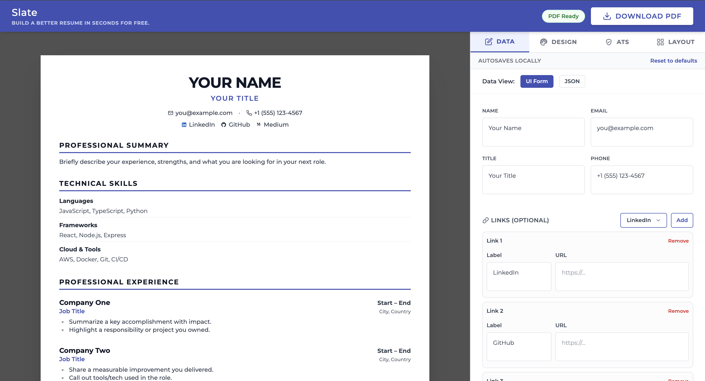
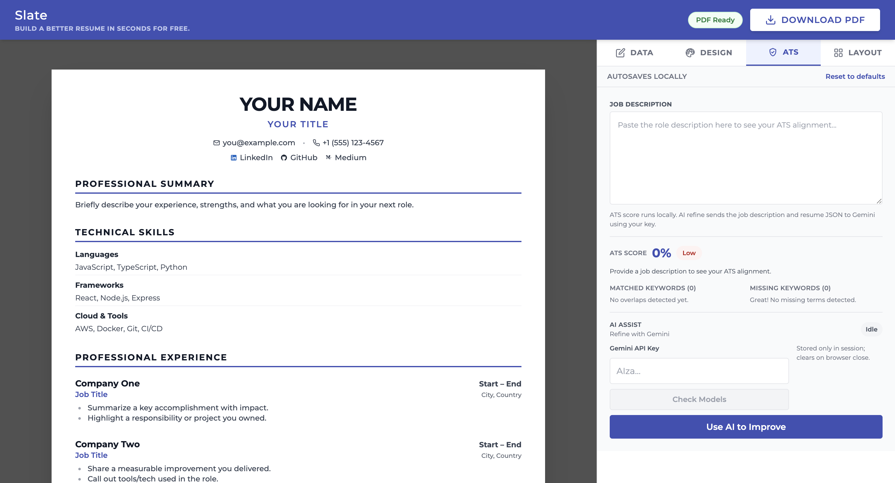

# Slate

Vite + React resume builder with live A4 preview, ATS analysis, and PDF export.

## Quickstart
1. Install deps: `npm install`
2. Run dev server: `npm run dev`
3. Open the URL shown (usually `http://localhost:5173`)

## Key Features
- Live preview with A4 page simulation, smart pagination, and PDF export (html2pdf.js).
- Data editing via JSON or structured UI form; autosaves to localStorage.
- Design controls: font family, base font size, colors, skills columns, scale.
- Layout tab: drag-and-drop section ordering via React Konva.
- ATS tab: local keyword overlap score, matched/missing keywords, tips, and optional Gemini-powered refinement using a session-only API key.

## Screenshots





## Deploy to GitHub Pages (static)
1. Install dependencies: `npm install`
2. Build the static site: `npm run build` (outputs to `dist/`)
3. Install gh-pages locally if you don’t have it: `npm install -D gh-pages`
4. Add these scripts to `package.json`:
   ```json
   "scripts": {
     "predeploy": "npm run build",
     "deploy": "gh-pages -d dist"
   }
   ```
5. Push your code to GitHub, then run: `npm run deploy`  
   This publishes `dist/` to the `gh-pages` branch.  
6. In your repo settings on GitHub, set Pages to serve from `gh-pages`/`(root)`.

### Optional: Auto-deploy with GitHub Actions
Already added at `.github/workflows/deploy.yml`:
- Triggers on push to `main`/`master`
- Installs, builds, and publishes `dist/` to `gh-pages` using `peaceiris/actions-gh-pages`
Make sure Pages is set to `gh-pages` branch in repo settings; no manual command needed after push.

## Architecture
- `src/types.ts` — shared types for resume data, config, ATS states.
- `src/constants.ts` — default resume data, config, fonts, storage keys.
- `src/utils/layout.ts` — A4 sizing constants for pagination.
- `src/utils/ats.ts` — ATS scoring, prompt builder, JSON extraction helpers.
- `src/App.tsx` — main UI (preview, data/design/ATS panels) wiring state, autosave, and Gemini refine.
- `src/index.css` — global styles (Montserrat + Tailwind base).

## Gemini AI Refine
1. Enable Generative Language API on your Google project and create an API key.
2. In the ATS tab, paste the job description and your key.
3. Click “Check Models” to select an available model, then “Use AI to Improve.”
   - Key is stored only in sessionStorage and cleared on browser close.

## Notes
- JSON view enforces schema validation; form edits keep JSON in sync.
- If Gemini returns invalid JSON, retry or switch to a supported model with quota.
- Input, textarea, and select controls are standardized to 12px Montserrat for consistency.
